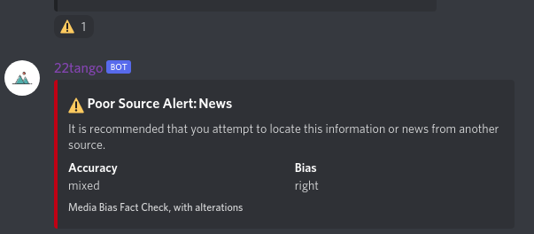
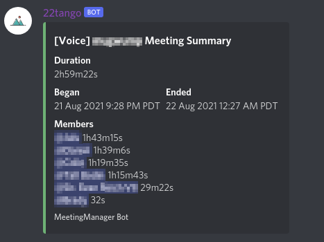
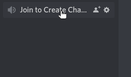

# **22tango** 

**A Discord management bot which handles meeting logging, temp channels, and role assignment**
## **Add to your server**

[Click here to add the 22tango bot to your server.](https://discord.com/api/oauth2/authorize?client_id=782730468156112957&permissions=8&scope=bot)

## **Functionality**

The bot can log meeting times, durations, and members (along with how much time each member spent in the meeting.)

Meetings with only one member or which last less than 2 minutes will not be logged by default.

The bot will output meeting logs to a configured meeting logs text channel within the server. To create this channel, make a text channel named `mm-logmeet`. It should be renamed by the bot to "meeting-logs" if all goes well.

The bot will generate personal voice channels when users join a generator channel. It is not compatible with other bots which offer this functionality.

To create a generator channel, create a voice channel called `mm-gen`. It will be renamed by the bot to "Join to Create a Channel" if successful.

Send `2!help` to see an informational panel.
## **Run** 

Set environment variable DISCORD_BOT_TOKEN to your bot token.

Clone repo, then `go run`.
## **Docker**

A Dockerfile is included in this repository which can be used for deployment.
## **Demo** :information_source: 	
### **Fact Check**

### **Meet Logs**

### **Meet Generator**

  
## **Support**

Documentation support will be [here.](https://github.com/ethanent/22tango/wiki)

For bug support, please open an [issue.](https://github.com/ethanent/22tango/issues)

## **Authors**

- [@ethanent](https://github.com/ethanent)
